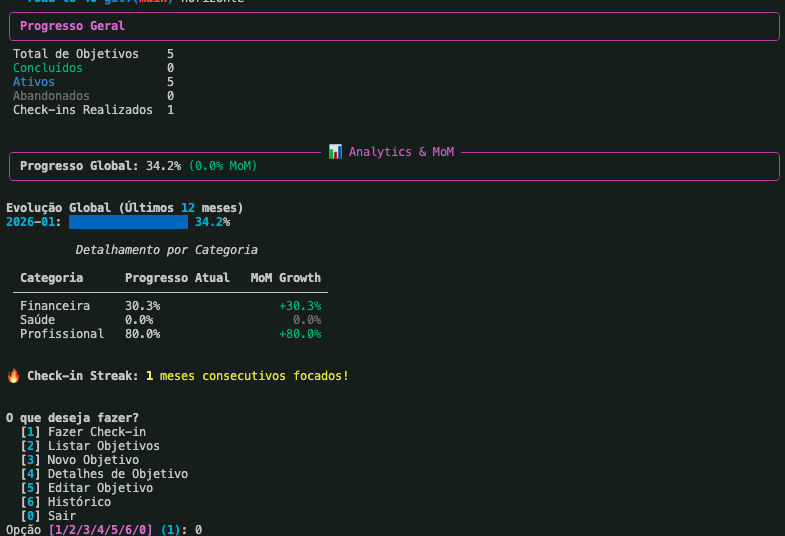

# Horizonte CLI

Uma Interface de Linha de Comando (CLI) poderosa e aprimorada por IA para acompanhar seus objetivos de vida, visão e progresso.

## Funcionalidades

- **Gerenciamento de Objetivos**: Crie, acompanhe e gerencie objetivos em diferentes categorias (Financeiro, Vida, Saúde, Profissional).
- **Horizontes Inteligentes**: Acompanhe sua visão de Curto Prazo vs Longo Prazo.
- **Integração com IA**:
    - **Critérios SMART**: A IA sugere critérios Específicos, Mensuráveis, Atingíveis, Relevantes e Temporais para seus objetivos.
    - **Check-ins Inteligentes**: Atualizações em linguagem natural (Corri 10KM esse mês) são analisadas automaticamente e aplicadas aos objetivos relevantes.
    - **Análise de Progresso**: Receba feedback motivacional e resumos analíticos do seu progresso.
- **Privacidade em Primeiro Lugar**: Todos os dados são armazenados localmente.

## Instalação

Você pode instalar a ferramenta globalmente para rodar o comando `horizonte` de qualquer lugar.

### 1. Pré-requisitos
Certifique-se de ter o [uv](https://github.com/astral-sh/uv) instalado.

### 2. Instalar Ferramenta
Execute o script de instalação ou instale manualmente:

**Via Script (Recomendado):**
```bash
./install.sh
```

**Manual via Git:**
```bash
uv tool install git+https://github.com/matheusbuniotto/horizonte-cli.git
```

## Como Usar

Após instalar, você pode rodar diretamente:

```bash
horizonte
```

Ou comandos específicos:

```bash
horizonte list
horizonte checkin
```

### Comandos Comuns

- `horizonte init`: Inicializa o banco de dados.
- `horizonte add`: Adiciona um novo objetivo (interativo).
- `horizonte list`: Lista todos os objetivos ativos.
- `horizonte checkin`: Inicia uma sessão de check-in interativa.
- `horizonte progress`: Visualiza seu progresso geral.
